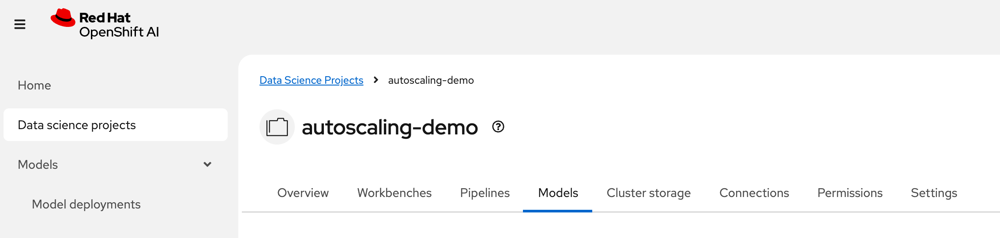
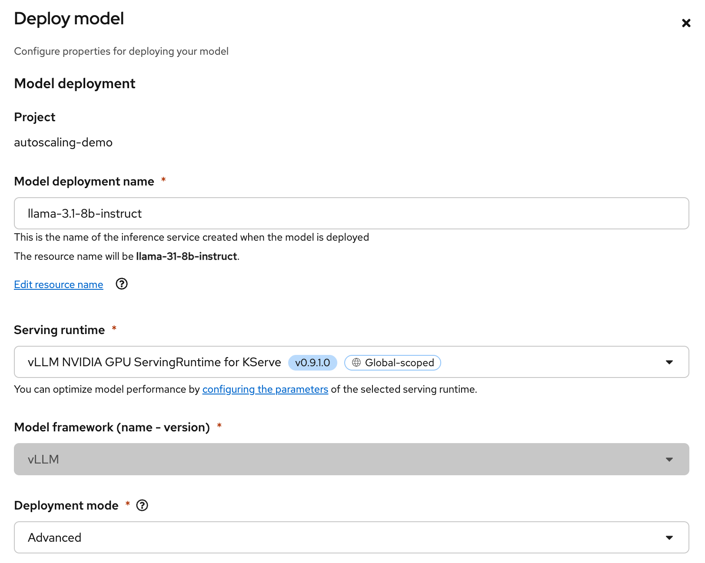
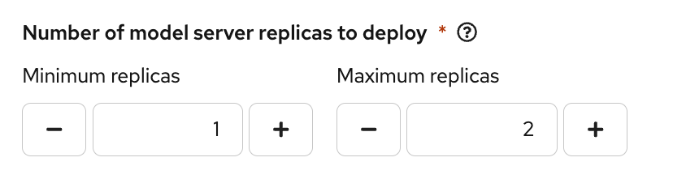
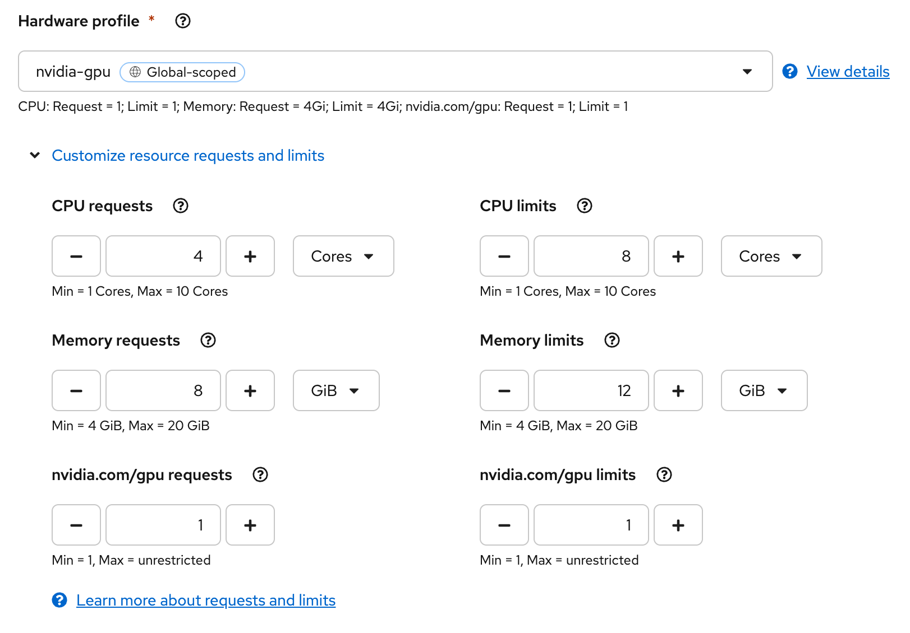
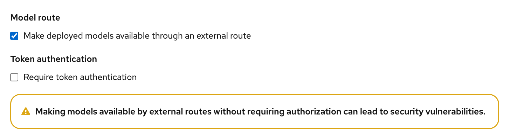
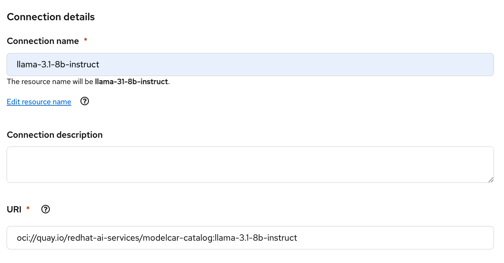
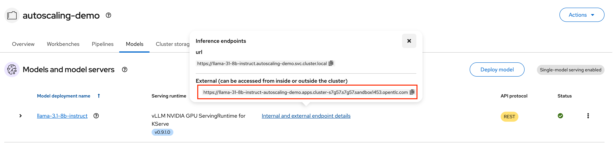

# Autoscaling vLLM with OpenShift AI

vLLM provides the ability to serve nearly any LLM on a large variety of hardware. That hardware can be quite expensive however, and you don't want to be burning money with idle GPU resources.  Instead, we can maximize our GPU resource utilization with KServe's autoscaling capabilities in OpenShift AI to autoscale our model servers.

## Autoscaling Capabilities Overview

In OpenShift AI we leverage Kubeflow's KServe project to help orchestrate our workloads.  KServe supports serving models in both a "Serverless" mode (aka Advanced mode in the RHOAI Dashboard UI) as well as a "RawDeployment" (aka Standard mode in the RHOAI Dashboard UI).  Serverless utilizes the Knative (Red Hat OpenShift Serverless) operator along with Istio (Red Hat OpenShift Service Mesh) while RawDeployments use normal k8s Deployments.

As of OpenShift AI 2.22, the latest stable release at the time of writing this, KServe supports "advanced" autoscaling with the "Serverless" deployment mode, which allows you to scale your model servers using Knative based on the number of concurrent requests and several other options that you can read more about [here](https://knative.dev/docs/serving/autoscaling/autoscaling-metrics/).  Knative will also allow us to take advantage of the ability to scale our model servers to zero when not in use.

KServe does also support autoscaling your model servers with RawDeployments, but our autoscaling metrics are limited to CPU and memory utilization, which are not very helpful since the majority of our workloads are limited by the GPU.  In future releases of OpenShift AI, KServe will support autoscaling RawDeployments using [KEDA](https://keda.sh/), which will give some similar capabilities to scale our model servers using the number of pending requests similar to how the Serverless mode functions.

For this article, we will be discussing the Serverless autoscaling capabilities.

## Pre-Reqs

In order to leverage the autoscaling capabilities within OpenShift AI we will need:

* The NVIDIA GPU Operator with the Node Feature Discovery Operator configured along with a compatible GPU node in our cluster
* The Red Hat OpenShift Serverless, Red Hat OpenShift Service Mesh 2, and (optional) Authorino operators
* The Red Hat OpenShift AI operator deployed and configured with a managed Service Mesh instance
* Additionally, you will need to configure a Hardware or Accelerator Profile for your NVIDIA GPU node in OpenShift AI

For more information on setting up and installing OpenShift AI, please refer to the official [docs](https://docs.redhat.com/en/documentation/red_hat_openshift_ai_self-managed/2.22/html/installing_and_uninstalling_openshift_ai_self-managed/installing-and-deploying-openshift-ai_install).

## Deploying Our Initial Model

1. To start, from the OpenShift AI Dashboard, create a new Data science project called `autoscaling-demo`, and navigate to the `Models` tab.  If asked, select the option for `Single-model serving`.



2. Select the option to `Deploy model` and enter the following details:

```
Model deployment name: llama-3.1-8b-instruct
Serving runtime: vLLM NVIDIA GPU ServingRuntime for KServe
Deployment mode: Advanced
```



As mentioned before, we will be utilizing the "Serverless" deployment mode which is labeled as "Advanced" in the OpenShift AI Dashboard.

3. Next we will set our minimum number of replicas to 1, and our maximum replicas to 2.  We will modify this later on to enable some of the autoscaling capabilities.



4. We will then select the nvidia-gpu Hardware or Accelerator Profile depending on which option you chose to configure when setting up OpenShift AI.  The following are a decent starting point for our model.

Note: Your UI may look slightly different if you are utilizing Accelerator Profiles.



5. Next you will configure the option for `Model route` but we will uncheck the option for `Token authentication` to make it easier to interact with our model.



6. For the `Connection type` select the option for `URI - v1`, give it a name, and enter the following for the URI:

```
oci://quay.io/redhat-ai-services/modelcar-catalog:llama-3.1-8b-instruct
```



We will be deploying our model using a ModelCar container which has prepackaged all of the model files into an OCI container image.  To learn more about ModelCar containers, take a look at the article [Build and deploy a ModelCar container in OpenShift AI](https://developers.redhat.com/articles/2025/01/30/build-and-deploy-modelcar-container-openshift-ai).

7. Finally, since I am using a smaller GPU (A10G with 24 GB of VRAM), I will need to limit the size of the KVCache for vLLM.  In my case, I will set `--max-model-len=10000` which is quite a bit smaller than what my GPU will support, but is large enough for this demo.  After configuring the option in the `Additional serving runtime arguments` we can choose the option to `Deploy`.

From the OpenShift Web Console, you can navigate to the Pods section with the `autoscaling-demo` namespace selected to see that our vLLM pod has successfully started or by running the following command:

```
oc get pods -n autoscaling-demo
```

To test our endpoint, we can get the URL for the route we created from the OpenShift AI Dashboard:



We can then do a simple curl command to make sure we are able to get a response from the model server.

```
curl https://<my-model-endpoint>/v1/models
```

Keep this command handy as we will use it again.

## Scale to Zero

Scale to zero allows us to reduce the number of replicas of our model server to none, while the model server is not being utilized.  This can help to greatly reduce the cost of running a model server that is seldom utilized.

To enable the scale to zero capabilities we can simply update the `Minimum replicas` option on the model server to 0, and `Redeploy`.  You should see your model server pod go into a `Terminating` state.

If you run the curl command again, you will see the pod get recreated.  However, the pod will likely not start before the curl command times out.  After the pod does successfully become ready, it will start terminating the pod again immediately after it is ready.

By default, Knative pretty aggressively scales the pods down when there are not any pending requests.  Since our vLLM pod takes some time to start, this isn't ideal so we need to configure an option to allow our pod to stick around a bit longer.

To do this, we will need to modify the InferenceService object that the OpenShift AI Dashboard created for us.  The easiest way to edit this object is to navigate to the `Home` -> `Search` section of the OpenShift Web Console.  Then you can click on the `Resources` drop down menu and select the InferenceService object.

Add the following annotation to the `spec.predictor` section of the InferenceService object.

```
spec:
  predictor:
    annotations:
      autoscaling.knative.dev/scale-to-zero-pod-retention-period: 1m
```

You should now see your pod staying in the `Ready` state for 1 minute after your last request.  Once it goes back to the terminating state, trigger your curl command again and this time the pod should stick around for a bit longer.  In a real world scenario, you may want to increase the retention time.

### Limitations of Scale to Zero

As you have already seen, the time it takes to start even a relatively small model like Llama 3.1 8b Instruct.  The startup time gets even worse when you are actively scaling GPU nodes and a GPU node is not ready for the model server to utilize.

This startup time does not make it ideal for use cases where an end user expects to be able to get an immediate response from an LLM.  However, if your LLM is being utilized by a pipeline, you can add a simple task that triggers the model to scale and waits for it to be ready before attempting to utilize it.  Additionally, if your model is only occasionally being used in a development environment, your developers can easily trigger the model to scale it up, complete their testing, and allow it to scale it back down when it isn't needed.

## Scaling Up

In addition to being able to scale a model server to zero, we can also scale a model server up to multiple replicas as our number of requests increase.

By default, KServe uses Knative `concurrency` mode to manage scaling.  `Concurrency` allows the model server to be scaled up based on the number of requests that are queued for the model server to process.  However, by default, the target concurrency is 100 requests per pod, which is more than our model server can handle before our requests start getting backed up.

For testing purposes we will set the scaling threshold very low in order to allow us to see the scaling in action.  To set this value, we will set the Knative target concurrency annotation on the `InferenceService` object.  Additionally, we will want to configure the time that it takes before Knative attempts to scale down the pods by setting an annotation.

```
spec:
  predictor:
    annotations:
      autoscaling.knative.dev/target: "2"
      autoscaling.knative.dev/scale-down-delay: "10m"
```

Now our model server will start to scale once it has two requests queued, and it will remain running for up to 10 minutes after it has scaled before it attempts to scale it back down.

To trigger the scaling, we can use the following script which will fire off several requests to the LLM without waiting for a response.

```sh
API_BASE_URL="https://<my-model-endpoint>/v1"
MODEL_NAME="llama-31-8b-instruct"
NUM_REQUESTS=10

for i in $(seq 1 $NUM_REQUESTS); do
    curl -X POST "$API_BASE_URL/chat/completions" \
        -H "Content-Type: application/json" \
        -d '{
            "model": "'$MODEL_NAME'",
            "messages": [{"role": "user", "content": "Test request #'$i'"}],
            "max_tokens": 1000
        }' \
        --silent \
        > /dev/null 2>&1 &
done
```

After running the script, you should see a new pod that is automatically scaled up by Knative.

Determining how many requests is appropriate to call for scaling for a model server can be tricky and will depend on a few factors, such as the model you are serving, the GPU hardware and vRAM available, and size/shape of the queries that are being submitted to the LLM.  Thankfully, tools like [guidellm](https://github.com/vllm-project/guidellm) can be a great place to start for performance testing and helping to determine how many requests your model server can handle.

### Limitations of Scaling Up

Like our scale-to-zero scenario, the biggest issue with scaling a vLLM instance is the time that it takes to start a model server, or even potentially scale up a new GPU node.  Because of this, we will need to factor in how long it takes for our new model server instance to start and our use case into our configuration.  

If you have minimal guarantees of being able to respond to queries in a specific timeframe you may be able to scale less aggressively, for example at 80% of your estimated queries your model server can process in parallel.  However, if you have contractual obligations to respond with specific latency requirements, you may need to scale more aggressively with something like 50% of your queries.

Additionally, leaving the model server up for a longer period of time can help to reduce the amount of "flapping" that the scaling my create if your workloads tend to spike frequently.

## Conclusion

In this article we have explored some of the capabilities of OpenShift AI for scaling LLM model servers with KServe and vLLM.

Autoscaling can be a valuable tool for an IT team trying to optimize the costs of the models they are serving.
