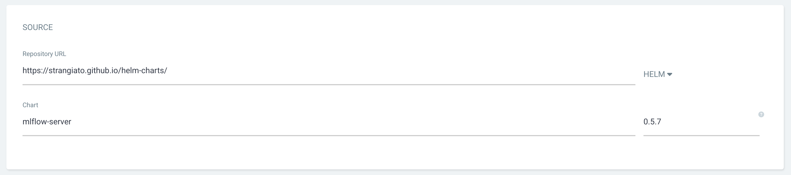
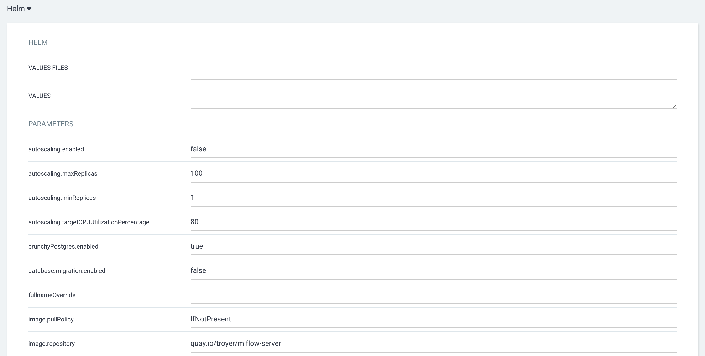

# Deploying Helm Charts with ArgoCD

ArgoCD provides a number of different ways to deploy resources from a Helm Chart.  We will discuss three different patterns that can be used to manage and deploy Helm Charts, and when and where to use each pattern.

1) Argo Application pointing at a chart in a Helm repo
2) Argo Application pointing at a chart in a git repo
3) Argo Application pointing at a Kustomize folder to rendering a chart

## Argo Application Pointing at a Chart in a Helm Repo

The first option for deploying a Helm Chart is by referencing a chart that is hosted in a Helm Repository.

When deploying a chart from the ArgoCD UI, users provide a URL to the Helm Repo containing a collection of charts and selects the `Helm` option in the `Source` menu.  The `Chart` and `Version` fields will provide a list available options from a dropdown menu to select from.



Once the a chart has been entered in the `Source` section, a `Helm` section will become available, allowing the user to specify a values file, values in a YAML format, or by directly editing the default parameters auto-populated from the chart.



### Advantages

Deploying a chart directly from a Helm Repo provides a simple and intuitive user experience when utilizing the UI.  The UI's auto-population of the default parameters helps to expose configurable options to the end users and avoid any mistakes such as misspelled parameter names.  This ease of use through the UI makes this one of the first options new users of Argo

### Disadvantages

This option makes it challenging to troubleshoot or render a helm chart from a development machine with the `Helm template` command.  Any parameters that are populated in the UI are added into the Argo Application object which can be manually duplicated on the command line when running `helm template` but this option leaves room for errors and typos.  The future option to add a `values.yaml` file from a separate git repo does greatly improve the ability to render the chart locally, but it can leave the `values.yaml` file orphaned in the git repo without any additional context, such as the chart repo, name, and version.

This design pattern also does not allow for any flexibility or customization to objects deployed in the chart that are not explicitly allowed by the original chart author.  For example, if the original author of a chart does not include options to set a  `nodeSelector` in the values, users will not have the ability to set that option in a `Deployment`.

### Other Considerations

Deploying the chart directly from a Helm Repo is best for deploying charts that are well maintained, documented and require minimal troubleshooting.  This option is great for rapid deployment/prototyping of charts or "set it and forget it" deployments.

The challenges of rendering the chart locally can make this option especially challenging when developing custom charts.  In many cases too much logic and configuration ends up in the Argo Application object and this becomes difficult to maintain.

This feature in Argo does not currently allow you to utilize another git repo as a source for the `values.yaml` file which is one of the main challenges with using this pattern for resources that need to be maintained over time.

## Argo Application Pointing at a Chart in a Git Repo

Another option for deploying a Helm Chart with Argo is by generating a chart and storing it directly in a git repo.  When using this option, users will provide a git repo URL and the path to the `Chart.yaml` file.  Argo will automatically detect the Helm Chart and render the chart when deploying.

Charts stored in the git repo can be a fully self contained chart with their own yaml templates or it can take advantage of chart dependencies to deploy charts hosted in a Helm Repo or another chart in the same git repo.  Utilizing a chart to configure a dependency and set parameters with the values.yaml file of that chart are sometimes referred to as a proxy chart.

To utilize a chart stored in a Helm Repo, you can provide the dependency information in the `Chart.yaml` object:

```yaml
dependencies:
  - name: "mlflow-server"
    version: "0.5.7"
    repository: "https://strangiato.github.io/helm-charts/"
```

To reference another chart located in the same git repo, you can utilize the `file://` protocol in the `Chart.yaml` files repository field:

```yaml
dependencies:
  - name: "my-local-chart"
    version: "0.1.0"
    repository: "file://../my-local-chart/"
```

Parameters can be configured in the local Helm Chart using the `values.yaml` file and Argo will automatically utilize this file when rendering the chart.

Leveraging chart dependencies within the same git repo allow for a flexible pattern for building out a multi-tiered application deployment to different environments.  By creating a simple chart folder structure such as the one below, users are able to develop a custom chart for an application deployed to multiple environments and provide configuration differences in the environment-charts `values.yaml` file.

```
.
├── common-charts
│   └── my-application
└── environment-charts
    ├── dev
    │   └── my-application
    ├── prod
    │   └── my-application
    └── test
        └── my-application
```

### Advantages

This design pattern provides the most native Helm developer experience, and easily allows developers to take advantage of Helms features such as `helm template` and `helm lint` in their local environment, allowing them to easily render the chart locally for testing.

Another advantage of this pattern when deploying to multiple environments is that it enables you to manage the lifecycle of your chart seperatly in each environment.  When utilizing a dependency of a chart stored in a Helm Repo, your dev environment can be utilizing `v1.1.0` while your prod environment is utilizing `v1.0.0`.

### Disadvantages

Like deploying a chart from a Helm repo, if the original author does not provide an option to configure a specific setting, users will not have the ability to set those options.

This option is also limited to only allowing users to provide parameters in the `values.yaml` file.  Users are not able to create separate `values.yaml` files for different environments in a single chart and instead must create a separate chart for each environment they wish to configure.

This pattern can also create "junk" files for a simple deployment that may not necessarily be needed in the final git repo, such as `.helmignore`, `Chart.lock`, or dependent chart `*.tgz` files that have been downloaded locally for testing.  Some of these files may be added to the `.gitignore` file to reduce clutter in the repo.

### Other Considerations

This option is ideal for getting maximum flexibility when developing a custom charts.  The ability to create a simple chart without needing to package and store it in a Helm Repo allows for extremely rapid prototyping.

If managing a chart with a more complex lifecycle, this pattern allows users to maintain different environments with different chart versions and promote changes through the environments in a similar way that Images can be promoted to different environments.

## Argo Application Pointing at a Kustomize Overlay Rendering a Chart

One final pattern for deploying Helm Charts with Argo is by rendering a Helm Chart with Kustomize.  In your `kustomization.yaml` file you can provide chart details including the Helm Repo, chart version, and values.  This provides similar capabilities to the proxy chart capabilities with the Kustomize tooling.

Values can be provided using `valuesFile` to reference a file relative to the `kustomization.yaml` file or with `valuesInline` where you can directly specify parameters.

```yaml
apiVersion: kustomize.config.k8s.io/v1beta1
kind: Kustomization

helmCharts:
- name: mlflow-server
  repo: https://strangiato.github.io/helm-charts/
  version: "0.5.7"
  releaseName: mlflow-server
  namespace: my-namespace
  valuesFile: values.yaml
  valuesInline:
    fullnameOverride: helloagain
```

From your local environment the chart can be rendered by running `kustomize build . --enable-helm`.

To utilize this option with Argo, the `enable-helm` flag must be provided in the ArgoCD object definition:

```yaml
apiVersion: argoproj.io/v1alpha1
kind: ArgoCD
metadata:
  name: argocd
spec:
  kustomizeBuildOptions: "--enable-helm"
```

### Advantages

If a team is already heavily relying on Kustomize in their GitOps environments, utilizing Kustomize to render a Helm Chart can help to keep a higher level of consistency with other configurations, and reduce the number of tools needed in the repo.

The combination of Kustomize with Helm also provides a powerful option to patch objects.  When leveraging the base/overlays Kustomize pattern, a Helm Chart can be rendered in the base layer, and additional patches can be applied in overlays.  The ability to apply patches after the Helm Chart is rendered allows you to modify the objects in ways the original chart author didn't include.

### Disadvantages

The `--enable-helm` flag introduces complexity when attempting to troubleshoot a chart locally.  Users may also experience issues if attempting to apply the Kustomize resources with `oc apply -k` since the Kustomize tools built into `oc`/`kubectl` do not support the `--enable-helm` flag.  Additionally, as already mentioned this option does require modification to the default ArgoCD deployment to enable the feature, which some users may not have permission to do.

Another consideration when using this pattern, is that once Kustomize has inflated the chart, the objects are treated just like any other yaml objects, and is no longer Helm Chart.  When utilizing the base/overlays model as described above, you will lose the ability to control the chart objects using the values parameters.

### Other Considerations

This option is ideal for users that are already heavily relying on Kustomize and don't want to introduce another tool their environment.  This option is also fantastic when you do not control the Helm Chart you are attempting to deploy, and you need to modify it in a way that the original author didn't include as a configurable option.

## Final Thoughts

In future versions of OpenShift GitOps, ArgoCD will support the ability to define multiple sources for objects such as a Helm Chart from one repo, and a `values.yaml` file from another, which could help to eliminate some of the shortcomings of option of deploying a Helm Chart directly from a Helm Repo.

One of the major challenges faced by the GitOps community is finding the "correct" way to manage resources and GitOps repo with growing complexity.  In many cases there is no "correct" solution and the three options presented here are all valid patterns for deploying and managing Helm Charts.  Hopefully the pros and cons discussed in this article help to provide some insight when next time you need to choose how to best incorporate a Helm Chart into your environment.
