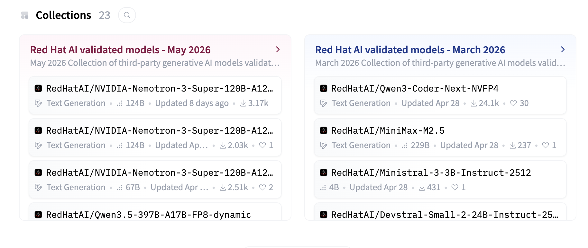
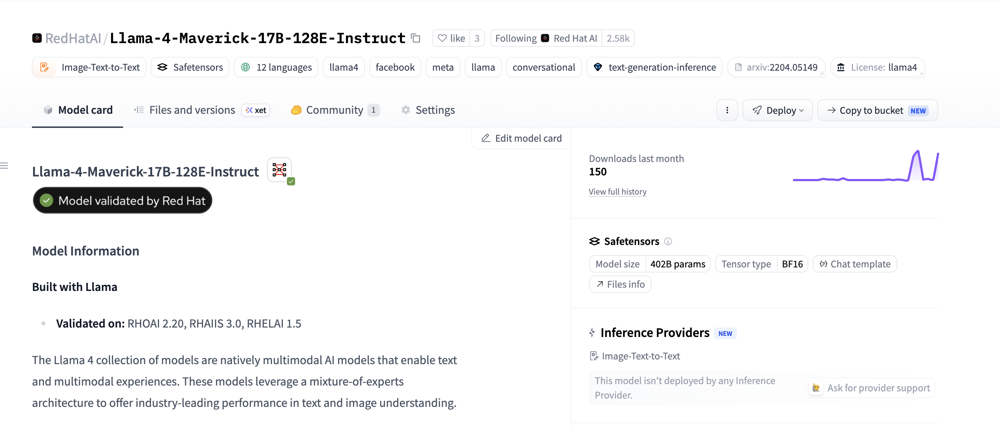
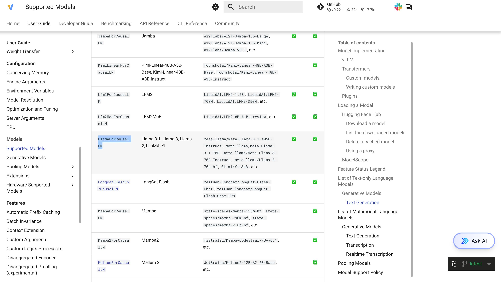
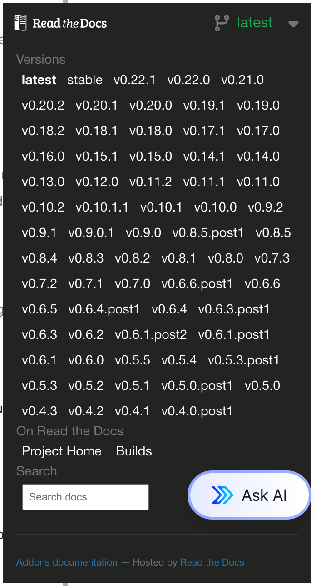

# Understanding the question "Is my model supported by vLLM?"

The release of new LLM models has been astounding, and it only appears to be accelerating.  Thankfully, the vLLM community has worked hard to keep pace with the rapid release of new model architectures, often providing day-zero support for newly released models.

This unfortunately leaves users often asking the question "what version of vLLM do I need to run my model?"

In this article we will explore how to answer this question.

## Red Hat Validated Models

Red Hat's [Validated Models](https://www.redhat.com/en/products/ai/validated-models) program is designed to help make it easier for customers to have confidence that the models they wish to deploy will work.

Models that are included in the Validated Models program have been rigorously tested by Red Hat engineering with official Red Hat vLLM images to ensure they will run.

You can find collections of the Validated Models on the [RedHatAI](https://huggingface.co/RedHatAI) HuggingFace page, where you can browse the Validated Models catalog.



Alternatively you can look up specific models under the RedHatAI page and look for the "Model validated by Red Hat" badge.



In addition to the "Model validated by Red Hat" badge, the model card will also include information on which version of OpenShift AI and Red Hat AI Inference the model has been validated on.

OpenShift AI users can also find the Validated Models in the Models section of the AI Hub.  Models in the AI Hub include Performance Insights data as well as the ability to easily deploy the model using a ModelCar image.

## vLLM Model Support Fundamentals

While the Validated Models program can help to provide customers confidence in their ability to support models that have already been tested by Red Hat, users may still find themselves trying to understand if a specific model is supported by vLLM that have not be validated by Red Hat.

In order to do this, it is helpful to understand how vLLM is able to support specific models.

One critical thing to understand, is that vLLM does not generally support specific models directly.  Instead it supports model architectures.

If we look at [Llama-3.3-70B-Instruct](https://huggingface.co/RedHatAI/Llama-3.3-70B-Instruct) we can view the config.json file and we will find an attribute called architectures:

```
  "architectures": [
    "LlamaForCausalLM"
  ],
```

The architecture of the model is a named representation of the specific features and structures of the model that the model utilizes.  These architectures can be used by many different models, even of different sizes.  For example, [Llama-3.1-8b-instruct](https://huggingface.co/RedHatAI/Llama-3.1-8B-Instruct/blob/main/config.json) also utilizes the `LlamaForCausalLM` model architecture.  While this specific model architecture was created by Meta, other model publishers can also use this same architecture when building their own models.

In most cases, if a model uses a supported architecture and does not introduce unsupported customizations, it should run on a vLLM release that supports that architecture.  In the future, if a model publisher decided to publish a new model in the future (e.g. Meta creates Llama 3.4) that uses the same architecture, that new model should be able to run on any vLLM version that already supports that model architecture.

## Checking vLLM Supported Models Page

The vLLM [Supported Models](https://docs.vllm.ai/en/latest/models/supported_models.html) documentation is generally the easiest way to determine if a specific model, or model architecture is supported by vLLM.

After identifying a model architecture, you can search for that architecture on the Supported Models page.  While a specific model such as Llama-3.3-70B-Instruct may not be explicitly listed on the supported models list, since we know that the model architecture is supported, we can confidently assume that Llama-3.3-70B-Instruct will be able to successfully run.



One important thing to keep in mind is that the Supported Models documentation will default to the `latest` release of vLLM and not all models are backwards compatible.



For example, [gemma-4-31b-it](https://huggingface.co/google/gemma-4-31B-it/blob/main/config.json) uses the model architecture `Gemma4ForConditionalGeneration` which is supported in the latest release of vLLM, but it is not supported in older versions of vLLM such v0.18.0, which was shipped in OpenShift AI/Red Hat AI Inference 3.4.

## Finding Red Hat Supported vLLM Images

vLLM is distributed by Red Hat under the [Red Hat AI Inference](https://docs.redhat.com/en/documentation/red_hat_ai_inference/) (RHAII) product name.  RHAII makes regular releases of vLLM that can be deployed by customers.  Additionally, OpenShift AI makes the same RHAII images available through the OpenShift AI platform.

RHAII images can be found in the `rhaii` namespace on the Red Hat Container Catalog, where they are published under a unique image depending on what accelerator you are using.  For example, the NVIDIA CUDA image can be found at [rhaii/vllm-cuda-rhel9](https://catalog.redhat.com/en/software/containers/rhaii/vllm-cuda-rhel9).

Understanding the version of vLLM shipped in each release of RHAII can be critical making informed decisions on which version of RHAII you may require to run your desired model.

The easiest way to determine which version of vLLM is shipped in each RHAII release is by checking the [Release notes](https://docs.redhat.com/en/documentation/red_hat_ai_inference/3.4/html-single/release_notes/index#rhaii-340-ga-new-vllm-dev-features)

RHAII releases a new version about once a month as either a Generally Available (GA) release or an Early Access (EA) release.  EA releases are not supported but can be used for testing newer models, while GA releases have a seven month support window.

Additionally, Red Hat publishes preview releases such as [rhaii-preview/vllm-cuda-rhel9](https://catalog.redhat.com/en/software/containers/rhaii-preview/vllm-cuda-rhel9) which can be used to test the latest releases of vLLM and models, often with day zero support for new models.

## Conclusion

Determining whether your model will run on vLLM comes down to a few practical checks. If you are deploying on Red Hat platforms, start with the Validated Models program or the OpenShift AI AI Hub to check if you are running models that Red Hat has already tested end to end. For everything else, look up the architecture in the model's `config.json`, confirm that architecture appears on the vLLM Supported Models page for the version you plan to use, and cross-reference the Red Hat AI Inference release notes if you are running a RHAII image.

The key insight is that vLLM supports model architectures, not individual model checkpoints. Two models that share an architecture should behave similarly from a compatibility standpoint, but newer architectures often require newer vLLM releases. Checking the documentation for your specific version—rather than assuming the latest docs apply—will save you from surprises at deploy time.
