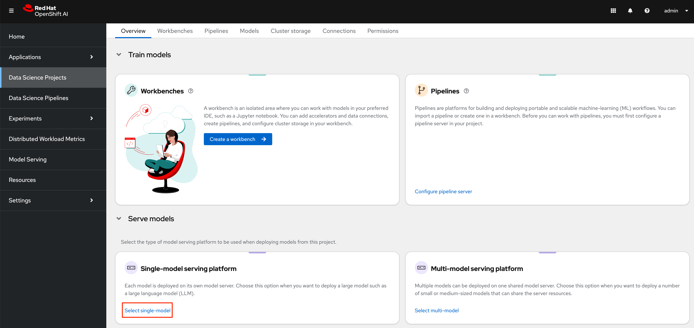
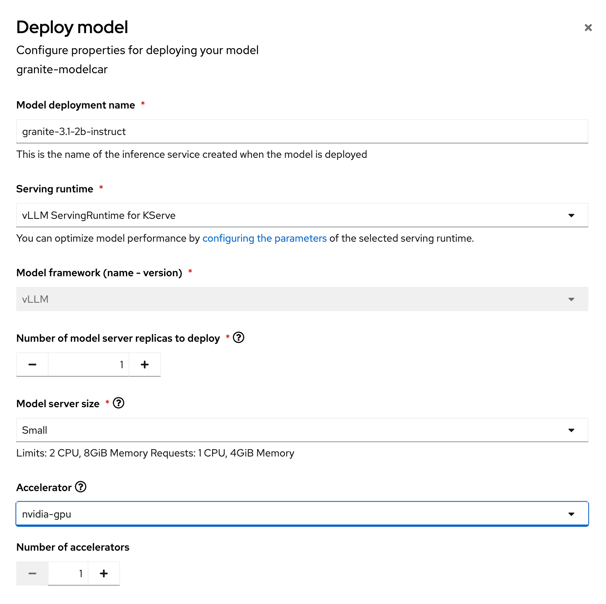

# Building and Deploying Models with ModelCar Containers in OpenShift AI

One challenge of managing models in a production environments with OpenShift AI and KServe is the dependency on S3 compatible storage.  When serving models using KServe in OpenShift AI, users must deploy S3 compatible storage somewhere accessible in their cluster and then upload their model to an S3 bucket.

Managing models through S3 creates new challenges for traditional Ops teams deploying production services.  Teams may need to create new processes to promote model artifacts from dev/test environments, and 

OpenShift AI 2.14 enabled the ability to serve models directly from a container using KServe's ModelCar capabilities and OpenShift AI 2.16 has added the ability to deploy a ModelCar image from the OpenShift AI Dashboard. 

## Building a ModelCar Container

ModelCar container requirements are quite simple; model files must be located in a `/models` folder of the container.  The container requires no additional packages or files.

Developers can simply copy the model files from their local machine into the container, but in our example we will use a two stage build process to first download a model from HuggingFace and then copy the files into a clean container.

We will use the [Granite 3.1 2b Instruct](https://huggingface.co/ibm-granite/granite-3.1-2b-instruct) model in our example.

To start, we will create a file called `download_model.py` with a simple script that uses the `huggingface-hub` package to download the model.

```python
from huggingface_hub import snapshot_download

# Specify the Hugging Face repository containing the model
model_repo = "ibm-granite/granite-3.1-2b-instruct"

snapshot_download(
    repo_id=model_repo,
    local_dir="/models",
    allow_patterns=["*.safetensors", "*.json", "*.txt"],
)
```

The script uses the `snapshot_download` function to download the granite model to the `/models` folder.

Next we will create a `Containerfile` with our two-stage build:

```dockerfile
FROM registry.access.redhat.com/ubi9/python-311:latest as base

RUN pip install huggingface-hub

# Download the model file from hugging face
COPY download_model.py .
RUN python download_model.py 

# Final image containing only the essential model files
FROM registry.access.redhat.com/ubi9/ubi-micro:9.4

# Copy the model files from the base container
COPY --from=base /models /models

USER 1001
```

In the first stage of the `Containerfile` we install the `huggingface-hub` package, copy our script into the container, then execute it to download the model files from HuggingFace.  In the next stage, we copy the model files from the first stage, into the second stage.

The two-stage build process allows us to minimize the content in the final container that we will use in our deployment.  While the difference in the container size of the final image compared to the original container is minimal, especially relative to the size of LLMs, by excluding these additional resources we reduce the potentially vulnerable packages that we need to run in our production environment.

To build the container, we will use `podman` to build the image in our local environment. 

```sh
podman build . -t modelcar-example:latest --platform linux/amd64
```

Finally, once the image has been built, you can push the image to a container registry such as quay.io.

```sh
podman push modelcar-example:latest quay.io/<your-registry>/modelcar-example:latest
```

Our ModelCar image is now ready to be deployed in an OpenShift AI cluster.

## Deploying a Model Server with a ModelCar Container

To deploy the model will will be using the vLLM instance that ships with OpenShift AI.  To deploy the model using the OpenShift AI Dashboard, you must be running OpenShift 2.16 or newer.  Your cluster will also require an NVIDIA GPU to successfully run the model.  An A10 GPU is a great budget option if you are provisioning a new node in your cluster.

To begin, create a new project in the OpenShift AI Dashboard where you plan to deploy your model.

Next, you will need to choose the option for `Select single-model` in the `Single-model serving platform` section.  Then click the option to `Deploy model`.



In the Deploy model page, add the following options:

```
Model deployment name: granite-3.1-2b-instruct
Serving runtime: vLLM ServingRuntime for KServe
Number of model server replicas to deploy: 1
Model server size: Small
Accelerator: nvidia-gpu
Number of accelerators: 1
Model route: Checked
Token authentication: Unchecked
```



Your accelerator name you be slightly differently depending on what your administrator called it when they configured the GPU capabilities in OpenShift AI.

When you get to the `Source model location` section, choose the option for `Create connection` and set the option type to `UIR - v1`.  For the `Connection details` use the following:

```
Connection name: granite-3.1-8b-instruct
URI: oci://quay.io/redhat-ai-services/modelcar-catalog:granite-3.1-2b-instruct
```

Feel free to replace the image URI with the image that you built and published in the previous section.

Once everything has been updated, click `Deploy`.

A new pod should be created in your namespace to deploy the model.  It may take several minutes to successfully pull the image for the first time, but on subsequent startups, the container image should be pre-cached on the node to help make the startup much faster.

---
**TIP**
By default KServe creates a KNative Serving object which has a default timeout of 10 minutes.  If your model has not successfully deployed in that time, KNative will automatically back the deployment off.

The first time you deploy the LLM on the node it may take longer than 10 minutes to deploy.  To change the default timeout behavior you can add the following annotation to the `predictor` portion of the `InferenceService` created by the OpenShift AI Dashboard.

```yaml
apiVersion: serving.kserve.io/v1beta1
kind: InferenceService
metadata:
  name: granite-31-2b-instruct
spec:
  predictor:
    annotations:
      serving.knative.dev/progress-deadline: 30m
```
---

After the pod has successfully started, you can now access your LLM by locating the URL in the OpenShift AI Dashboard.

## The Pros and Cons of ModelCar Containers

ModelCar presents a great opportunity to standardize the way in which an organization delivers models between environments, by allowing them to leverage the same technologies and automation they likely already have for managing container images.  Making the models as portable as any other container image while also reducing the risk of a file not getting copied from one environment to another brings all of the same benefits that we love about container images for application management.

Once cached on a node, the process of starting a vLLM instance can also be significantly faster than the model startup time from S3 compatible storage.

However, working with ModelCar images can introduce new challenges due to the size of the LLMs and the corresponding image.  A small LLM such as the Granite 2B model creates a container about 5Gb while a medium size model such as the Granite 8B will be about 15Gb.  Very large models such as Llama 3.1 405b will be about 900Gb in size making it very challenging to manage as a container image.

Building large containers can be challenging with the large amount of resources required and pulling very large container images can quickly overwhelm a node's local cache.

Some of these challenges may become less pronounced over time as new technologies help bridge the gap.  Tools such as [KitOps](https://kitops.ml/) are attempting to more intelligently package models into container images, and other improvements are added to Kubernetes to help improve the ability to pull large container images.

To find more patterns and pre-built ModelCar images, take a look at the Red Hat AI Services [ModelCar Catalog repo](https://github.com/redhat-ai-services/modelcar-catalog) on GitHub and the [ModelCar Catalog registry](https://quay.io/repository/redhat-ai-services/modelcar-catalog) on Quay.
