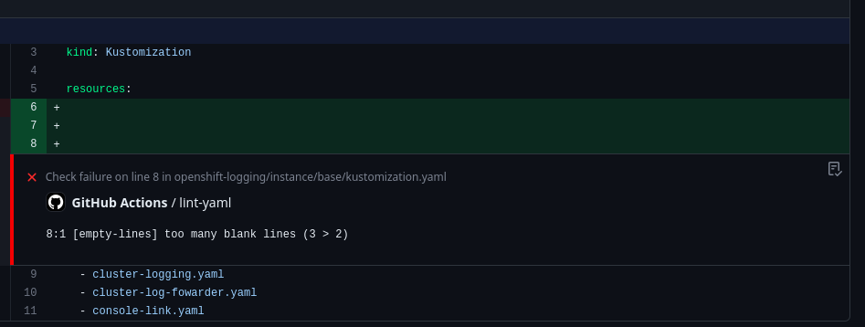

# Validating GitOps Manifests

One of the major challenges of managing a cluster and application resources with GitOps is validating that changes to the GitOps manifests are correct.  

When making changes to objects directly on the cluster the user is immediately presented with feedback when issues exist. The user is able to troubleshoot and resolve those issues with the knowledge of the context of the changes they just made.  When working with GitOps, that feedback cycle is often delayed and users don't receive feedback on changes until they are applied to the cluster, which could be hours or even weeks depending on the approval lifecycle of a change.

To help reduce the number of errors in changes to a GitOps manifest and eliminate the dreaded `Unknown` state in an ArgoCD Application, this article will discuss tools and best practices that can help to reduce the feedback cycle on those changes.  We will discuss automating these validations with GitHub actions, but all of these validations can be configured with another CI tool of your choice.

## YAML Linting

YAML is the basis of nearly all GitOps repos.  As you would expect, YAML has specific syntax standards for what is valid and what is not.  Additionally, there are many recommended best practices that may not be required but can help improve the consistency and readability of the YAML.

YAML Linters are a great tool to help validate requirements on a repo and help to enforce consistent style for some of the optional configurations.

Many different YAML Linter tools exists, but one that I recommend is [yamllint](https://github.com/adrienverge/yamllint).  `yamllint` is built with Python, making it easy to setup on most Linux/MacOS environment since Python is installed by default and Python can be easily installed on any Windows environment.

To install `yamllint` you can run the following command with `pip`, the Python package management tool:

```sh
pip install --user yamllint
```

Once installed, users can use the `yamllint` cli tool to manually validate individual files:

```sh
yamllint my-file.yaml
```

Or an entire directory structure:

```sh
yamllint .
```

`yamllint` provides a default configuration that may provide warnings for some style standards that you many not wish to enforce.  The default options can easily be configured by creating a file called `.yamllint` in the root of the project.  The following is a common configuration used in many GitOps repos:

```yaml
extends: default

rules:
  document-start: disable
  indentation:
    indent-sequences: whatever
  line-length: disable
  truthy:
    ignore: .github/workflows/
```

### Automating with GitHub Actions

Running `yamllint` locally is a great option for developers to get feedback while making changes to a repo, however running `yamllint` directly in a CI tool such as GitHub Actions can help to enforce standards and prevent improperly formatted YAML from ever making it into the main branch.

To add a yamllint GitHub action, we can utilize an pre-built GitHub Action and create a file called `.github/workflows/validate-manifests.yaml` in your project containing the following:

```yaml
name: Validate Manifests
on:
  push:
    branches:
      - "*"
  pull_request:
    branches:
      - "*"

jobs:
  lint-yaml:
    runs-on: ubuntu-latest
    steps:
      - name: Code Checkout
        uses: actions/checkout@v3
      - name: Validate YAML
        uses: ibiqlik/action-yamllint@v3
        with:
          format: github
```

One great feature of `yamllint` is that it has native integration with GitHub and can do annotations directly on the lines of code with issues, making it easier for developers to identify problems and resolve them.



### What This is Good For

YAML linters are designed to enforce generic YAML standards and make sure that objects are properly structured based on those generic standards.  YAML linters are great for identifying issues with misconfigurations in YAML, such as extra lines in files, or incorrect tabbing in objects.  YAML linters can be great for catching problems where objects are incorrectly copied and pasted into a repo, or a field is accidentally duplicated in the same object.  YAML linters can also help to keep GitOps repos more consistent and enforce some chosen standards for all contributors to the repo, making the repo more readable and maintainable.

However, YAML linters are generally not able to do any sort of deeper inspection of the objects and they do not validate the object against the expected schema for that object type.

## Kustomize Validation

Kustomize is one of the most common tools found in a GitOps repo for helping to organize and deploy YAML objects.  Repos can commonly contain dozen, if not hundreds of `kustomization.yaml` files that can be incorrectly configured and cause errors when you reach the deployment step if not validated beforehand.

A simple validation can be performed using the `kustomize` cli tool:

```sh
kustomize build path/to/my/folder
```

The command above will attempt to render the folder using kustomize and display the final YAML objects.  If it successfully renders, the `kustomization.yaml` file is valid, and if it does not, kustomize will display an error to help troubleshoot the issue.

When making changes in kustomize, it can be easy to cause unforeseen problems.  Therefor, it is always recommended to validate all kustomize resources in a repo, even those that you have not directly changed.  A script that looks for all `kustomization.yaml` files in the repo, and attempts to run `kustomize build` for each folder can help to validate that no unintentional errors have been created.  Fortunately the Red Hat CoP has already created a [script](https://github.com/redhat-cop/gitops-catalog/blob/main/scripts/validate_manifests.sh) to do exactly that.  Copy the `validate_manifests.sh` directly into a GitOps repo (generally I store it in a scripts folder) and you can run the script with the following:

```sh
./scripts/validate_manifests.sh
```

### Automating with GitHub Actions

Just like the YAML lint, validating the kustomize in a CI tool is an important step to adding confidence to changes to a repo and ensuring that no errors are introduced into the main branch.

Conveniently, GitHub Actions already has the kustomize tool built in so we can create a simple action to run the previously mentioned script by adding a new job to the same validation action we created before:

```yaml
jobs:
  lint-kustomize:
    runs-on: ubuntu-latest
    steps:
      - name: Code Checkout
        uses: actions/checkout@v3
      - name: Verify Kustomize CLI Installation
        run: |
          which kustomize
          kustomize version
      - name: Validate Manifests
        run: |
          ./scripts/validate_manifests.sh
```

### What This is Good For

Kustomize is a powerful tool, but one that is easy for human error to cause problems.  This simple practice of validating every `kustomization.yaml` file in a repo can help to reduce the number of errors created by accidentally misspelling a filename, or forgetting to update a filename in the `kustomization.yaml` file after renaming it.  This kustomize check can also help to identify problems where objects are updated and any patches that impact those objects are no longer valid.

Additional, this validation can help to ensure that you don't accidentally break dependencies where another `kustomization.yaml` file inherit from a folder you did make changes to.  Problems such as when an object is removed from a base folder and that same object is being referenced in the overlay can be quickly caught before the changes are ever merged into the main branch.

## Validating Helm

Helm is another popular tool that is utilized in GitOps repos for organizing complex applications.  Helm is an extremely powerful tool but one that can be prone to errors due to its complex syntax, and structure.

Fortunately Helm provides a built in tool to help validate charts within the cli:

```sh
helm lint path/to/my/chart
```

Helm's linting capabilities will help to validate the template code to ensure that it is valid, verify all of the necessary values are present, and emit warnings for other recommendations.

Like with the kustomize script we can automate validating all of the charts in the repo by searching for any `Chart.yaml` files.  The following script can be created in a file called `validate_charts.sh`:

```sh
#!/bin/sh

for i in `find "${HELM_DIRS}" -name "Chart.yaml" -exec dirname {} \;`;
do

    echo
    echo "Validating $i"
    echo

    helm lint $i

    build_response=$?

    if [ $build_response -ne 0 ]; then
        echo "Error linting $i"
        exit 1
    fi

done

echo
echo "Charts successfully validated!"
```

All of the charts in a repository can easily be validate at once by running the following command:

```sh
./scripts/validate_charts.sh
```

### Automating with GitHub Actions

This new script can be triggered from a GitHub Action just like the previous kustomize check, however in this case, helm is not built into the base action so it must be installed:

```yaml
jobs:
  helm-lint:
    runs-on: ubuntu-latest
    env:
      HELM_VERSION: 3.12.3
      HELM_DIRS: .
    steps:
      - name: Install Helm
        run: |
          sudo curl -L -o /usr/bin/helm https://get.helm.sh/helm-v${HELM_VERSION}-linux-amd64.tar.gz
          sudo chmod +x /usr/bin/helm
      - name: Code Checkout
        uses: actions/checkout@v3
      - name: Validate Charts
        run: |
            ./scripts/validate_charts.sh
``` 

### What This is Good For

Helm linting can help to catch many non-obvious issues in a change.  Helm is notorious for its complexity and the challenges that the templating language can introduce.  Common issues such as misspelling a value name or incorrectly scoping a variable can all be caught quickly with the helm linting tool.  Additionally, a helm lint can help to catch other configuration issues in a Chart such as an invalid reference in the `Chart.yaml` file.

Helm linting does not do any validation on the YAML from the rendered charts and only validates that the chart can be rendered. In some cases, it may be beneficial to apply additional validations on the rendered charts themselves.

## Next Steps and Limitations

The validations above are a great first step for improving the confidence to changes in a GitOps repo before they are ever attempted to be deployed.  Running this validations can help to avoid common mistakes that are made in GitOps and allow users to catch and resolve problems before they are ever attempted to be validated against the cluster.

One major limitation of the checks above is the lack of validation of the objects being applied to a cluster. If a field only accepts a value of `true` or `false` the validations discussed today will not be able to identify an invalid configuration such as this. 

More specialized tools such as `kubeval` and `kubeconform` can help to validate standard Kubernetes objects but they lack support for OpenShift specific objects or CustomResources from Operators out of the box.  [Extracting schemas](https://cloud.redhat.com/blog/validating-openshift-manifests-in-a-gitops-world) for those objects is possible, which can help to extend validation of objects even beyond standard k8s objects.

Additionally, validations can be performed directly against a target cluster itself using the `--dry-run=server` flag with `oc apply`.  Using the dry-run flag allows the objects to be validated against the cluster itself and provides an even greater degree of confidence that objects that may get applied to the cluster will be successful.