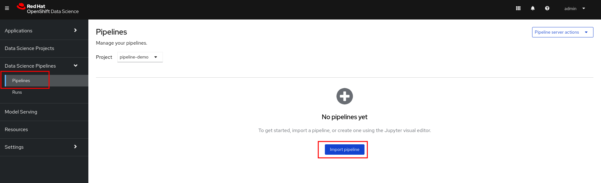
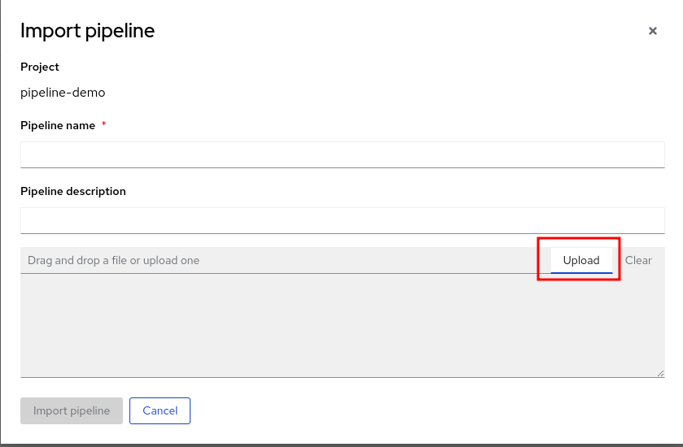
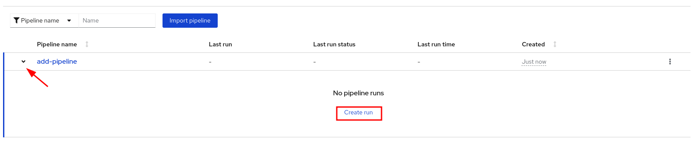
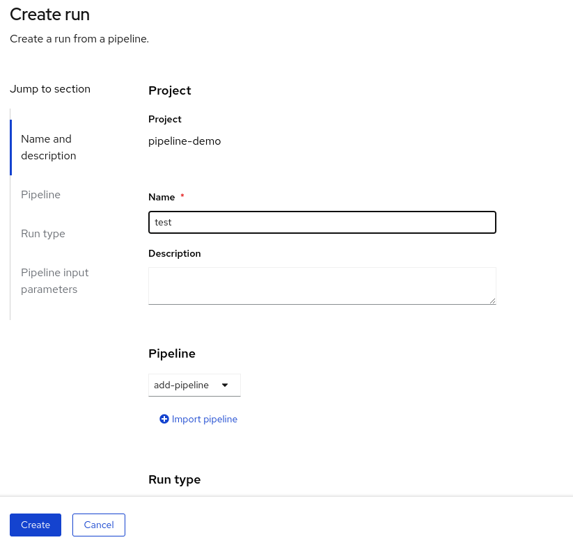
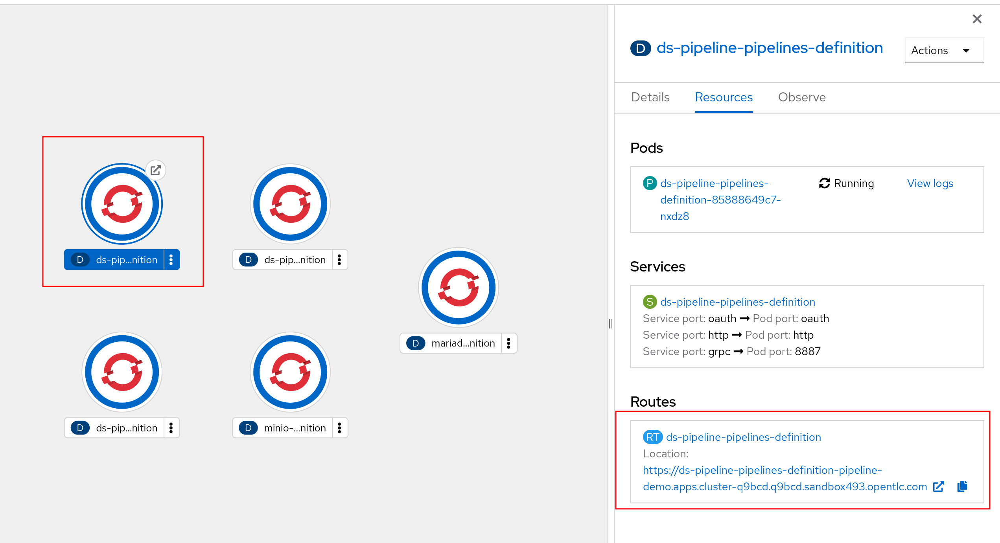
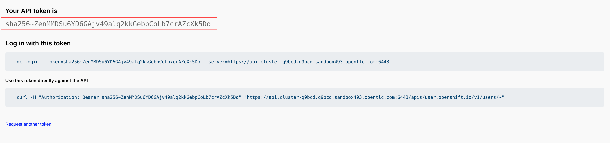
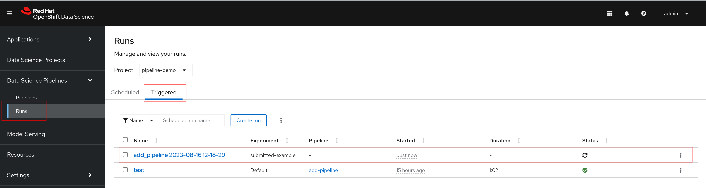

# Working with Data Science Pipelines - Executing Pipelines with Kubeflow Pipelines

Red Hat OpenShift Data Science, part of OpenShift.AI, introduced Data Science Pipelines in RHODS 1.x.  Data Science Pipelines is Red Hat's enterprise ready, multi-tenant implementation of Kubeflow Pipelines, built on top of Tekton as the execution engine.

For this tutorial we will start with a simple 

## A Simple Pipeline

For this example we will be working with the `kfp` and `kfp_tekton` in a native python application.

At the time of writing this, Data Science Pipelines uses `kfp_tekton` 1.5.  Newer versions of the `kfp_tekton` package are not backwards compatible with the current version of Data Science Pipelines.  The following command will install the latest version of `kfp_tekton` 1.5 in your client environment and the latest version of `kfp` that is compatible with `kfp_tekton`.

```sh
pip install kfp_tekton~=1.5.0 kfp
```

In our pipeline, we will use the `kfp` package to construct our pipeline, and `kfp_tekton` to communicate with the Data Science Pipelines server.

To begin, we will create a new file called `add_pipeline.py` and we will import the packages:

```python
import kfp
import kfp_tekton
```

Next we will create a simple add function:

```python
def add(a: float, b: float) -> float:
    """Calculate the sum of the two arguments."""
    return a + b
```

We will then use that add function to create a kfp component.  A component is a self-contained step to be executed in our pipeline.  The component defines both the code to be executed (the `add` function from the previous step) and the image that will be used to execute the code.  In this case, we are using the Python image provided by OpenShifts built in container registry.  

```python
add_op = kfp.components.create_component_from_func(
    add,
    base_image="image-registry.openshift-image-registry.svc:5000/openshift/python:latest",
)
```

Alternatively we could build our own image with additional python packages already installed if we need additional packages in the step.  The `create_component_from_func` function also provides us additional configuration options, including the `packages_to_install` parameter that will allow kfp to install additional packages during the execution of the step.

Finally, we can compose our pipeline using `add_op` as the different steps in our pipeline.  The `@kfp.dsl.pipeline` decorator allows us to easily convert a standard function into 

```python
@kfp.dsl.pipeline(
    name="Add Pipeline",
    description="A pipeline that adds numbers together",
)
def add_pipeline(a="1", b="7"):
    first_add_step = add_op(a, 4)
    second_add_step = add_op(first_add_step.output, b)
```

## Three Methods for Executing a Pipeline

Next we will look at three different methods for taking the pipeline we composed above and executing them in Data Science Pipelines.

In the previous steps we leveraged the `kfp` package to compose our pipeline.  In the following examples we will leverage the `kfp_tekton` package to help us compile or communicate with the Data Science Pipeline server directly.

### Generating a YAML Object

For the first option, we will be using `kfp_tekton` to compile the pipeline into a YAML object that can be manually uploaded into the RHODS Dashboard.  Once the pipeline has been uploaded, the pipeline can be executed, or scheduled to run on a set interval.

To generate the YAML file, we can add the following to the `add_pipeline.py` file we created before:

```python
if __name__ == "__main__":
    kfp_tekton.compiler.TektonCompiler().compile(
        add_pipeline, package_path=__file__.replace(".py", ".yaml")
    )
```

Next we can execute the file to generate a new file called `add_pipeline.yaml`:

```sh
python add_pipeline.py
```

The newly created `app_pipeline.yaml` file will contain a Tekton PipelineRun object that can now be uploaded to the RHODS Dashboard.

Using the project we created in part one, from the Data Science Pipelines > Pipelines section click on the option to `import pipeline`:



Next, enter a pipeline name and description, then click on the `upload` and navigate to the `add_pipeline.yaml` file created in the previous step.



After the pipeline has been successfully uploaded, you can now create a new run of the pipeline.  Click on the `>` to expand the pipeline and click `Create run`.



Enter a name for the run and click `Create`.



A new pipeline run will execute our add pipeline.

#### When to Use this Option

The option to generate a pipeline as a YAML object is one of the easiest and most straight forward ways of working with Data Science Pipelines.  It is a great option when attempting to test out an initial pipeline or validating if a pipeline will execute correctly.

In the case that a pipeline is not expect to change regularly or the pipeline is expected to be configured as a scheduled job without any regular updates, this option is generally the easiest and fastest way to accomplish those goals.

However, due to the number of manual steps needed to upload and execute a pipeline it is generally not a great option beyond a simple proof of concept in most cases and one of the following options is generally recommended.

### Submitting a Run from Python

Instead of compiling the pipeline into a YAML object and manually uploading that to the Dashboard, `kfp_tekton` provides the ability to create a client connect directly to the Data Science Pipeline instance, where we can submit a run directly from the development environment.

As part of the creation of the DataSciencePipelineApplication object, the Data Science Pipeline Operator will create the `ds-pipeline-pipelines-definition` Deployment, with a Route.  We will use this Route to connect to the pipeline instance.



Additional, this Route is secured by an OpenShift OAuth Proxy, which means that we will need to authenticate in our client connection using our OpenShift account.  To do this, we will need to provide a `Bearer Token`.  A `Bearer Token` is a string that can be used for authentication requests in an API request.  `Bearer Tokens` are short lived tokens that are only valid for about 24 hours.

To obtain your `Bearer Token` you can utilize the `Copy login command` option from the OpenShift Web Console:




Or if you are already logged in you can use the following command:

```sh
oc whoami --show-token
```

Now that we have the information that we need, we can update the code from our previous pipeline to create a new client object using the `TektonClient` function, where we can provide it the URL from the Route and the `Bearer Token`.  Next we will use the new client object to execute a new run of the pipeline using the `create_run_from_pipeline_func`.  In addition to the `add_pipeline`, we can optional provide the pipeline with arguments for the run and an experiment.

```python
if __name__ == "__main__":
    client = kfp_tekton.TektonClient(
        host="https://ds-pipeline-pipelines-definition-pipeline-demo.apps.my-cluster.com",
        existing_token="sha256~ZenMMDSu6YD6GAjv49alq2kkGebpCoLb7crAZcXk5Do",
    )

    arguments = {"a": "7", "b": "8"}
    client.create_run_from_pipeline_func(
        add_pipeline, arguments=arguments, experiment_name="submitted-example"
    )
```

> Tip:
> In the example above we have hard coded our host and token into the client connection as a string for the sake of simplicity.  Generally this information should be abstracted out of the code and accessed from an environment variable.  Python provides the `os.environ` standard library for reading environment variables from the system and there are a number of third party packages such as [python-dotenv](https://pypi.org/project/python-dotenv/) that can help making working with environment variables easier.  The `Bearer Token` is a secret that should never be checked into git or shared between users as it would allow anyone to login to the OpenShift cluster as if they were the user.

In the Dashboard, a new Run will be created and start executing:



#### When to Use this Option

This option is great for rapid prototyping or when building the initial pipeline.  The ability to submit a run directly from a development environment make it easy to iterate on different parts of the pipeline without having to manually upload the pipeline to the Dashboard every time the pipeline is changed.

This option can also be useful when executing the run from inside of another CI process.  Using tools like OpenShift Pipelines (Tekton), you can create a fully automated CI pipeline triggered by a code commit to git that builds an image containing the necessary python packages, and execute the pipeline run without any manual steps.

One disadvantage of this method is that it creates a run directly from python and does not create a pipeline artifact in the Dashboard.  This makes it impossible to utilize some features such as the scheduling capabilities or the ability to trigger new runs directly from the Dashboard.

### Uploading a Pipeline From Python and Trigger a Run